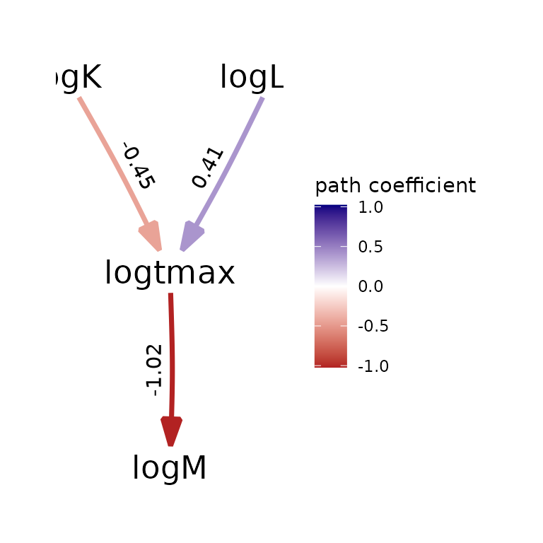
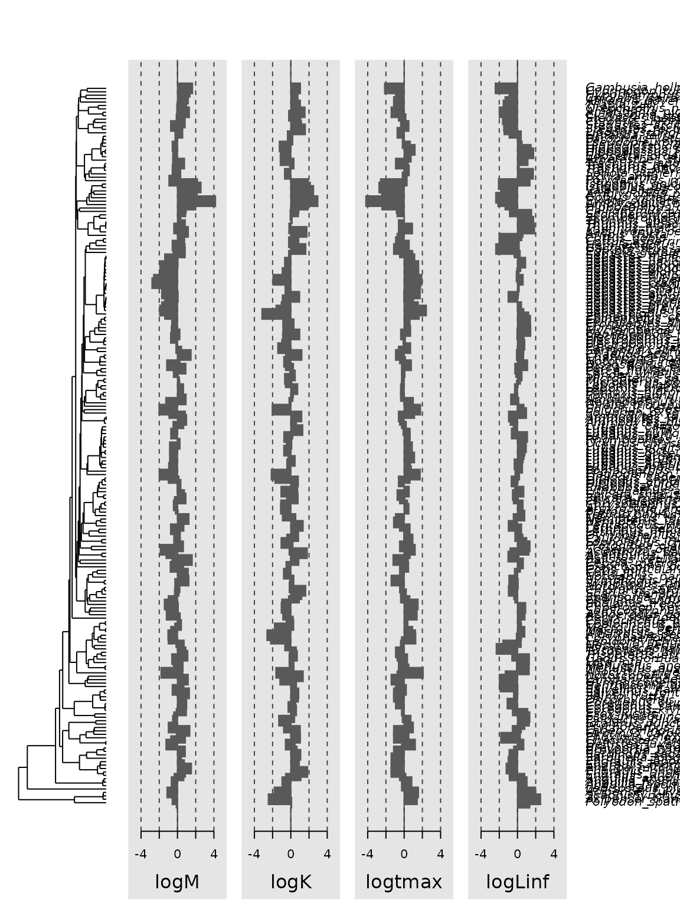
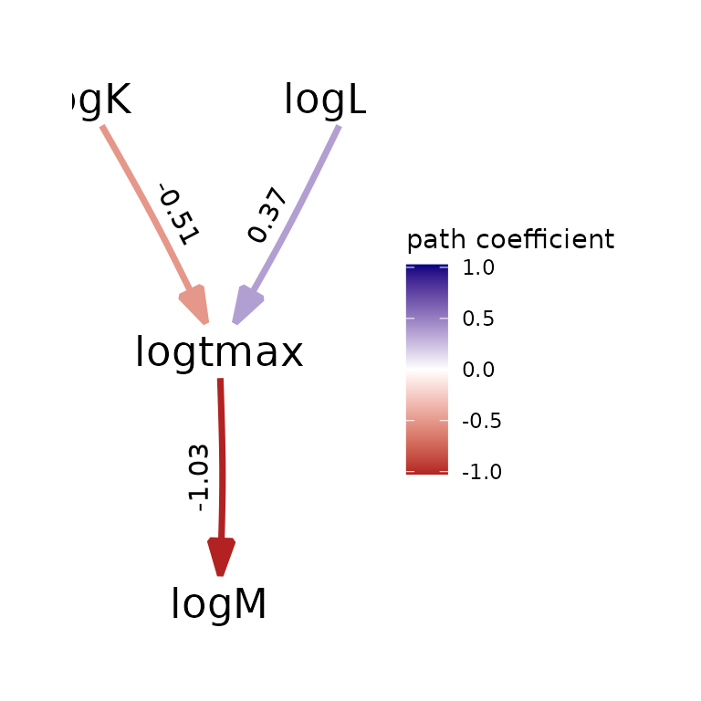

# Phylogenetic comparative methods in fisheries science

Phylogenetic comparative methods (PCM) are rarely in fisheries science,
perhaps due to a lack of familiarity with methods and software among
fisheries scientists. This underuse is surprising, given that fisheries
science and management strongly depends on foundational results from
comparative methods regarding fish productivity and life-history
parameters, e.g., for defining proxies for biological reference points
and informing hard-to-estimate demographic rates such as stock-recruit
and natural mortality parameters.

## Preparing the Then et al. mortality database

To demonstrate the potential role for PCM in fisheries science, we
re-analyze a foundational dataset compiled by [Then et
al.](https://www.vims.edu/research/departments/fisheries/programs/mort_db/).
We specifically download the file “Mlifehist_ver1.0.csv” and then
include a copy as a data object in package *phylosem* to simplify the
following demonstration. This demonstration then provides basic syntax
and output from PCM, showing the relationship between natural mortality
rate, longevity, and growth parameters.

To do so, we first load a phylogeny for fishes using package *fishtree*,
which includes several versions of a phylogeny for fishes develoepd by
[Rabosky et al.](https://doi.org/10.1038/s41586-018-0273-1). We then
associate all trait data with a tip label from that phylogeny, and
provide convenient names for the modeled variables.

``` r

# Load packages
library(phylosem)
library(fishtree)

# Download tree
out = fishtree_complete_phylogeny()
tree = out[[1]]

# Load data object
data( Mlifehist_ver1_0 )
Data = Mlifehist_ver1_0

# Reformat to match tree$tip.label
Data$Genus_species = factor( paste0(Data$Genus, "_", Data$Species) )

# Drop duplicates ... not dealing with variation among stocks within species
Data = Data[match(unique(Data$Genus_species),Data$Genus_species), ]

# log-transform to simplify later syuntax
Data = cbind( Data, "logM" = log(Data[,'M']),
                    "logK" = log(Data[,'K']),
                    "logtmax" = log(Data[,'tmax']),
                    "logLinf" = log(Data[,'Linf']) )

# Identify species in both datasets
species_to_use = intersect( tree$tip.label, Data$Genus_species )
species_to_drop = setdiff( Data$Genus_species, tree$tip.label )

# Drop tips not present in trait-data
# Not strictly necessary, but helpful to simplify later plots
tree = ape::keep.tip( tree, tip=species_to_use )

# Drop trait-data not in phylogeny
# Necessary to define correlation among data
rows_to_use = which( Data$Genus_species %in% species_to_use )
Data = Data[rows_to_use,]

# Only include modeled variables in trait-data passed to phylosem
rownames(Data) = Data$Genus_species
Data = Data[,c('logM','logK','logtmax','logLinf')]
```

## Fitting and selecting among phylogenetic structural equation models

We then define a path diagram specifying a set of linkages among
variables. In the following, we use a path diagram that ensures that
mortality rate is statistically independent of growth, conditional upon
a measurement for longevity. This specification ensures that, if
longevity is available, then it is the sole information used to predict
mortality rate. However, if longevity is not available, the model
reverts to predicting mortality from growth parameters.

We then fit this model using phylogenetic structural equation models. We
specifically apply a grid-search across the eight models formed by any
combination of modeled transformations of the phylogenetic tree. We then
use marginal AIC to select a model, and list estimated path
coefficients.

``` r

# Specify SEM structure
sem_structure = "
  logK -> logtmax, b1
  logLinf -> logtmax, b2
  logtmax -> logM, a
"

# Grid-search model selection using AIC for transformations
Grid = expand.grid( "OU" = c(FALSE,TRUE),
                    "lambda" = c(FALSE,TRUE),
                    "kappa" = c(FALSE,TRUE) )
psem_grid = NULL
for( i in 1:nrow(Grid)){
  psem_grid[[i]] = phylosem( data=Data,
                   tree = tree,
                   sem = sem_structure,
                   estimate_ou = Grid[i,'OU'],
                   estimate_lambda = Grid[i,'lambda'],
                   estimate_kappa = Grid[i,'kappa'],
                   control = phylosem_control(quiet = TRUE) )
}

# Extract AIC for each model and rank-order by parsimony
Grid$AIC = sapply( psem_grid, \(m) AIC(m) )
Grid = Grid[order(Grid$AIC,decreasing=FALSE),]

# Select model with lowest AIC
psem_best = psem_grid[[as.numeric(rownames(Grid[1,]))]]
```

| OU    | lambda | kappa |      AIC |
|:------|:-------|:------|---------:|
| FALSE | TRUE   | TRUE  | 1552.940 |
| FALSE | TRUE   | FALSE | 1553.164 |
| TRUE  | TRUE   | TRUE  | 1559.502 |
| TRUE  | FALSE  | TRUE  | 1561.424 |
| TRUE  | TRUE   | FALSE | 1563.372 |
| FALSE | FALSE  | TRUE  | 1643.863 |
| TRUE  | FALSE  | FALSE | 1717.509 |
| FALSE | FALSE  | FALSE | 2358.137 |

| Path                  | VarName           | Estimate | StdErr | t.value | p.value |
|:----------------------|:------------------|---------:|-------:|--------:|--------:|
| NA                    | Intercept_logM    |    1.668 |  0.318 |   5.250 |   0.000 |
| NA                    | Intercept_logK    |   -1.759 |  0.566 |   3.107 |   0.002 |
| NA                    | Intercept_logtmax |   -0.575 |  0.655 |   0.878 |   0.380 |
| NA                    | Intercept_logLinf |    6.559 |  0.445 |  14.742 |   0.000 |
| logK -\> logtmax      | b1                |   -0.448 |  0.067 |   6.716 |   0.000 |
| logLinf -\> logtmax   | b2                |    0.407 |  0.086 |   4.731 |   0.000 |
| logtmax -\> logM      | a                 |   -1.022 |  0.037 |  27.732 |   0.000 |
| logM \<-\> logM       | V\[logM\]         |    0.056 |  0.014 |   3.966 |   0.000 |
| logK \<-\> logK       | V\[logK\]         |    0.105 |  0.026 |   4.047 |   0.000 |
| logtmax \<-\> logtmax | V\[logtmax\]      |    0.078 |  0.019 |   4.029 |   0.000 |
| logLinf \<-\> logLinf | V\[logLinf\]      |    0.082 |  0.020 |   4.122 |   0.000 |

## Visualizing output

Finally, we can convert output to formats from other packages, and use
existing and third-party PCM packages to plot, query, and post-process
output.

``` r

# Plot path diagram
my_fitted_DAG = as_fitted_DAG(psem_best)
plot(my_fitted_DAG, type="color")
#> Warning: Cannot determine which variables of this model are binary, so the scale of its coefficients is unknown.
#>   Paths into a binary variable are log odds ratios, while paths into a continuous variable are standardized regression coefficients.
#> ℹ This model was fitted by a version of phylopath older than 1.4.0, which did not record it. Refit it to label the coefficients, and to stop receiving this warning.
```



``` r


# Total, direct, and indirect effects
my_sem = as_sem(psem_best)
effects(my_sem)
#> 
#>  Total Effects (column on row)
#>               logK   logtmax    logLinf
#> logtmax -0.4480233  0.000000  0.4073488
#> logM     0.4579994 -1.022267 -0.4164192
#> 
#>  Direct Effects
#>               logK   logtmax   logLinf
#> logtmax -0.4480233  0.000000 0.4073488
#> logM     0.0000000 -1.022267 0.0000000
#> 
#>  Indirect Effects
#>              logK logtmax    logLinf
#> logtmax 0.0000000       0  0.0000000
#> logM    0.4579994       0 -0.4164192
```

We also show how to plot output using phylosignal, although it is
currently unavailable on CRAN and therefore commented out:

``` r

# Load for plotting,
# https://r-pkgs.org/vignettes.html#sec-vignettes-eval-option
library(phylosignal)

# Plot using phylobase
my_phylo4d = as_phylo4d( psem_best )
barplot(my_phylo4d)
```



## Sensitivity to using taxonomic tree

After analysis, we can also conduct sensivity analyses. Here, we show
how to construct a taxonomic tree and use this in place of phylogenetic
information. As before, this requires some code to reformat the data and
then the statistical analysis is simple to specify. The estimated path
coefficients are very similar to estimates when using phyogeny.

``` r

library(ape)
Data = Mlifehist_ver1_0

# Make taxonomic factors
Data$Genus_species = factor( paste0(Data$Genus, "_", Data$Species) )
Data$Genus = factor( Data$Genus )
Data$Family = factor( Data$Family )
Data$Order = factor( Data$Order )

# Make taxonomic tree
tree = ape::as.phylo( ~Order/Family/Genus/Genus_species, data=Data, collapse=FALSE)
tree$edge.length = rep(1,nrow(tree$edge))
tree = collapse.singles(tree)
tmp = root(tree, node=ape::Ntip(tree)+1 )

# Drop duplicates ... not dealing with variation among stocks within species
Data = Data[match(unique(Data$Genus_species),Data$Genus_species), ]

# log-transform to simplify later syuntax
Data = cbind( Data, "logM" = log(Data[,'M']),
                    "logK" = log(Data[,'K']),
                    "logtmax" = log(Data[,'tmax']),
                    "logLinf" = log(Data[,'Linf']) )

# Only include modeled variables in trait-data passed to phylosem
rownames(Data) = Data$Genus_species
Data = Data[,c('logM','logK','logtmax','logLinf')]

# Fit model
psem_taxon = phylosem( data=Data,
                 tree = tree,
                 sem = sem_structure,
                 estimate_ou = TRUE,
                 control = phylosem_control(quiet = TRUE) )

# Plot path diagram
my_fitted_DAG = as_fitted_DAG(psem_taxon)
plot(my_fitted_DAG, type="color")
#> Warning: Cannot determine which variables of this model are binary, so the scale of its coefficients is unknown.
#>   Paths into a binary variable are log odds ratios, while paths into a continuous variable are standardized regression coefficients.
#> ℹ This model was fitted by a version of phylopath older than 1.4.0, which did not record it. Refit it to label the coefficients, and to stop receiving this warning.
```


