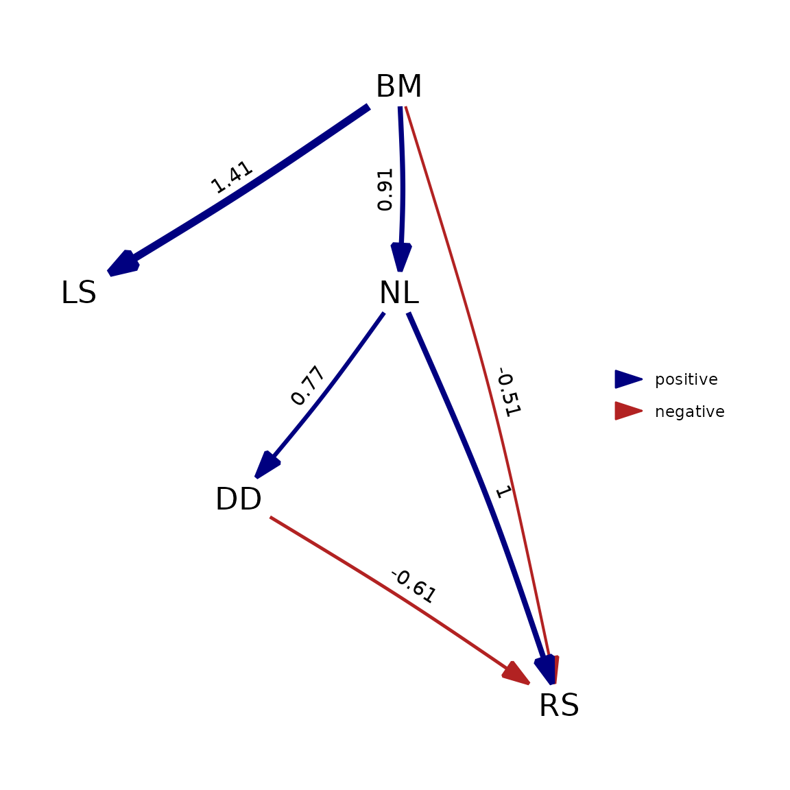
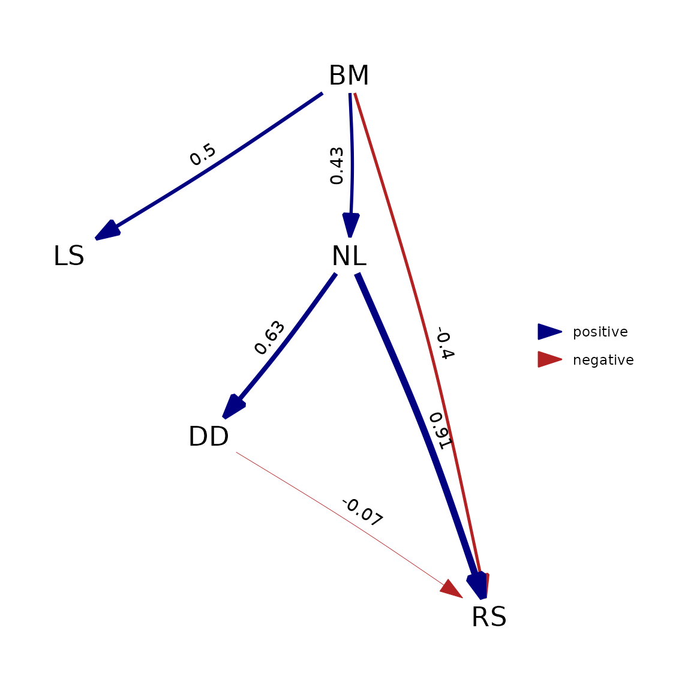
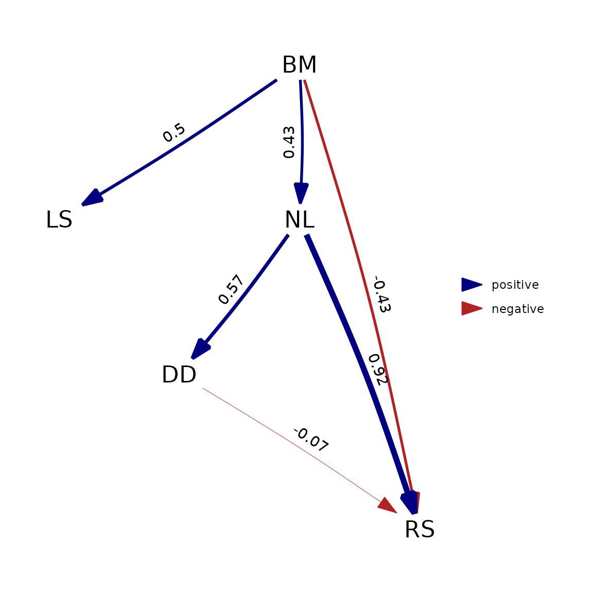

# Detailed comparison with \`phylopath\`

[*phylopath*](https://doi.org/10.7717/peerj.4718) is a package that
implements phylogentic path analysis, using the d-separation methodology
described by [Von Hardenberg &
Gonzalez-Voyer](https://doi.org/10.1111/j.1558-5646.2012.01790.x). The
models that can be fit are essentially a subset of the models that can
be fit using *phylosem*. This is a comparison between the two packages,
based on the introduction vignette of *phylopath*, showing where the
packages are similar and where they differ. This should also be useful
for *phylopath* users, that want to do the same kinds of analysis in
*phylosem*.

To clearly show from which package each function originates, I’ll use
the `package::function` notation. Make sure you have both packages
installed.

### Model comparison: some important differences

Let’s start by loading the Rhinogrades example data and phylogeny.

``` r

data(rhino, rhino_tree, package = 'phylopath')
```

When we supply the data to the model comparison functions, there is
already two important differences to flag here.

Firstly, `phylo_path` only consciders the columns of the data that are
actually used in the models. But `compare_phylosem` does not. In
`rhino`, our first column contains a copy of the species names, and so
we need to exclude this column (using `rhino[-1]`). So, when using
*phylosem*, make sure your data.frame contains only the variables you’d
like to inlcude in the analysis.

Secondly, to get standardized path coefficients, *phylopath* will
standardize the data so that each variable has unit variance, but
*phylosem* keeps data on their original scale. To make a better
comparison between the packages, I’ll standardize the data manually
here.

``` r

rhino_std <- rhino[-1]
rhino_std[] <- lapply(rhino_std, scale)
```

Now we can define what causal models we want to compare. First in
`phylopath`, we use formulas and can use
[`DAG()`](https://ax3man.github.io/phylopath/reference/DAG.html) to
define a model, or
[`define_model_set()`](https://ax3man.github.io/phylopath/reference/define_model_set.html)
to create a list of models:

``` r

models_pp <- phylopath::define_model_set(
  one   = c(RS ~ DD),
  two   = c(DD ~ NL, RS ~ LS + DD),
  three = c(RS ~ NL),
  four  = c(RS ~ BM + NL),
  five  = c(RS ~ BM + NL + DD),
  six   = c(NL ~ RS, RS ~ BM),
  seven = c(NL ~ RS, RS ~ LS + BM),
  eight = c(NL ~ RS),
  nine  = c(NL ~ RS, RS ~ LS),
  .common = c(LS ~ BM, NL ~ BM, DD ~ NL)
)
```

In `phylosem`, we can define the models similarly, but need to use
strings instead. Also note that we need to write out the parameter in
front of each varialble (e.g. `b1`, `b2`, etc.). To compare multiple
models, we collect all the models in a `list`:

``` r

models_ps <- list(
  one   = 'RS = b1 * DD',
  two   = 'DD = b1 * NL; RS = b2 * LS + b3 * DD',
  three = 'RS = b1 * NL',
  four  = 'RS = b * BM + b2 * NL',
  five  = 'RS = b1 * BM + b2 * NL + b3 * DD',
  six   = 'NL = b1 * RS; RS = b2 * BM',
  seven = 'NL = b1 * RS; RS = b2 * LS + b3 * BM',
  eight = 'NL = b1 * RS',
  nine  = 'NL = b1 * RS; RS = b2 * LS'
)
# we add the .common paths, by pasting them at the end of each of the model strings, e.g.:
models_ps <- lapply(
  models_ps, 
  \(x) paste(x, c('LS = b1_ * BM; NL = b2_ * BM; DD = b3_ * NL'), sep = '; ')
)
```

We can now run the model comparison. *phylopath* will use d-separation
here, while *phylosem* is fitting each structural equation model itself.

Note that for `phylo_path`, we specify here that we want the Brownian
motion model (`"BM"`), which is the default for `compare_phylosem`.

``` r

result_pp <- phylopath::phylo_path(
  models_pp, data = rhino_std, tree = rhino_tree, model = 'BM'
)

library(phylosem)
result_ps <- phylosem::compare_phylosem(
  models_ps, tree = rhino_tree, data = rhino_std
)
```

How did our models perform? For *phylopath* we can use `summary` to get
a table with CICc values:

``` r

summary(result_pp)
#>       model k  q     C        p  CICc delta_CICc        l        w
#> five   five 4 11  60.7 3.39e-10  85.7        0.0 1.00e+00 1.00e+00
#> eight eight 6  9 101.9 2.36e-16 121.9       36.2 1.38e-08 1.38e-08
#> three three 6  9 111.8 2.69e-18 131.8       46.0 1.00e-10 1.00e-10
#> nine   nine 5 10 110.7 3.80e-19 133.2       47.5 4.85e-11 4.85e-11
#> six     six 5 10 111.0 3.36e-19 133.5       47.8 4.25e-11 4.25e-11
#> one     one 6  9 113.9 1.03e-18 133.9       48.2 3.49e-11 3.49e-11
#> four   four 5 10 113.7 9.38e-20 136.2       50.5 1.08e-11 1.08e-11
#> two     two 5 10 115.2 4.85e-20 137.6       51.9 5.31e-12 5.31e-12
#> seven seven 4 11 114.2 5.28e-21 139.2       53.5 2.45e-12 2.45e-12
```

For *phylosem*, we can extract the AIC values for each model:

``` r

sapply(result_ps, AIC) |> sort()
#>     five    eight     four      six     nine      two    seven      one 
#> 1680.150 1730.808 1732.720 1732.720 1732.739 1733.104 1734.716 1735.057 
#>    three 
#> 1736.103
```

Even though the methodology used is quite different, we do obtain a
similar result: model 5 fits much better than the other models.

However, the methods do somewhat differ in the ranking of the other
models. This is largely due to the different philosophies of the two
approaches. *phylopath* uses the PPA method as described by Von
Hardenberg & Gonzalez-Voyer, which uses Shipley’s d-separation. In
essence, this method finds pairs of variables that a causal model claims
are independent (or conditionally independent), and then tests whether
that is indeed the case. *phylosem* on the other hand directly evaluates
the fit of the casual model to the data. So in a sense, *phylosem*
analyzes the paths included in the model while *phylopath* analyzes the
paths that are not included.

Another source of difference is that the CICc metric used by *phylopath*
employs a correction for small sample sizes that the *phylosem*’s AIC
metric does not.

In conclusion, in cases where one model clearly fits best (and under a
Brownian motion model) I would expect the methods to lead to the same
conclusion, but don’t expect model comparison results to match closely.

### Model fitting: sometimes different

To take the best model, a particular model, or to perform model
averaging, *phylopath* and *phylosem* work largely in the same way. Both
packages have implemented the
[`best()`](https://james-thorson-noaa.github.io/phylosem/reference/best.md),
[`choice()`](https://james-thorson-noaa.github.io/phylosem/reference/choice.md)
and
[`average()`](https://james-thorson-noaa.github.io/phylosem/reference/average.md)
methods for their respective output types.

We can get the best model (model 5) using
[`best()`](https://james-thorson-noaa.github.io/phylosem/reference/best.md).
For *phylopath* the paths are now fitted, for *phylosem* this has
already been done and the model is just extracted from the
`compare_phylosem` object:

``` r

best_pp <- phylopath::best(result_pp)
best_ps <- phylosem::best(result_ps)
```

To compare the two, we can convert the *phylosem* result in to the DAG
format that *phylopath* uses, and use the included plot functionality:

``` r

plot(best_pp)
```


``` r

plot(as_fitted_DAG(best_ps))
```



*phylopath* is now actually fitting the causal model itself, not
performing the d-separation procedure. Because this makes the methods
much more closely aligned, we can see that the output matches very
closely.

However, this will generally only hold true when assuming Brownian
motion. If we deviate from that assumption by using (as an example)
Pagel’s lambda model, which is the default in *phylopath*, this is no
longer true:

``` r

phylopath::est_DAG(
  models_pp$five, data = rhino_std, tree = rhino_tree, model = 'lambda'
) |> plot()
```



``` r

phylosem::phylosem(
  models_ps$five, tree = rhino_tree, data = rhino_std, estimate_lambda = TRUE
) |> as_fitted_DAG() |> plot()
```



The reason this happens is that *phylosem* implements these additional
parameters by estimating them as a single estimated parameter for the
all variables in the model. *phylopath*, on the other hand, estimates a
separate lambda on the residuals of each regression ran. For
[`est_DAG()`](https://ax3man.github.io/phylopath/reference/est_DAG.html)
this means one lambda for each variable with a modelled cause, and for
[`phylo_path()`](https://ax3man.github.io/phylopath/reference/phylo_path.html)
this means one lambda for each tested d-separation statement.
