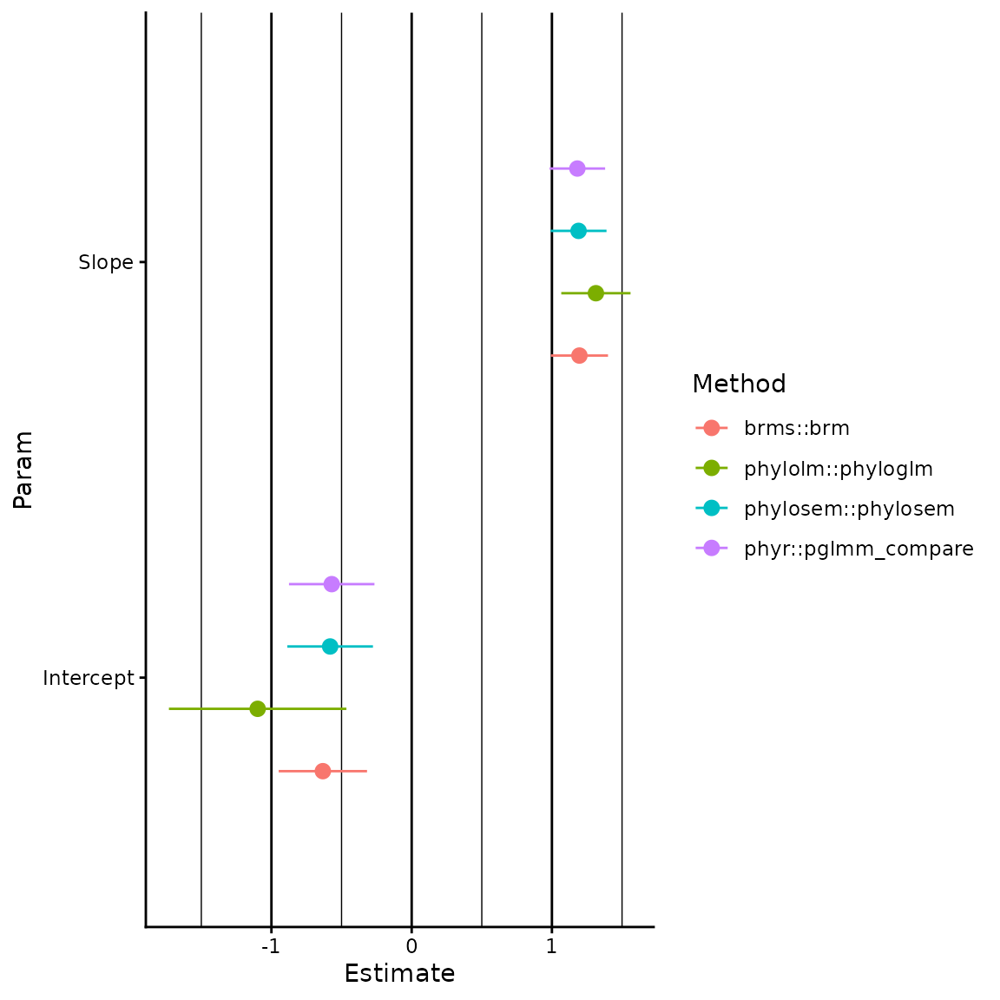
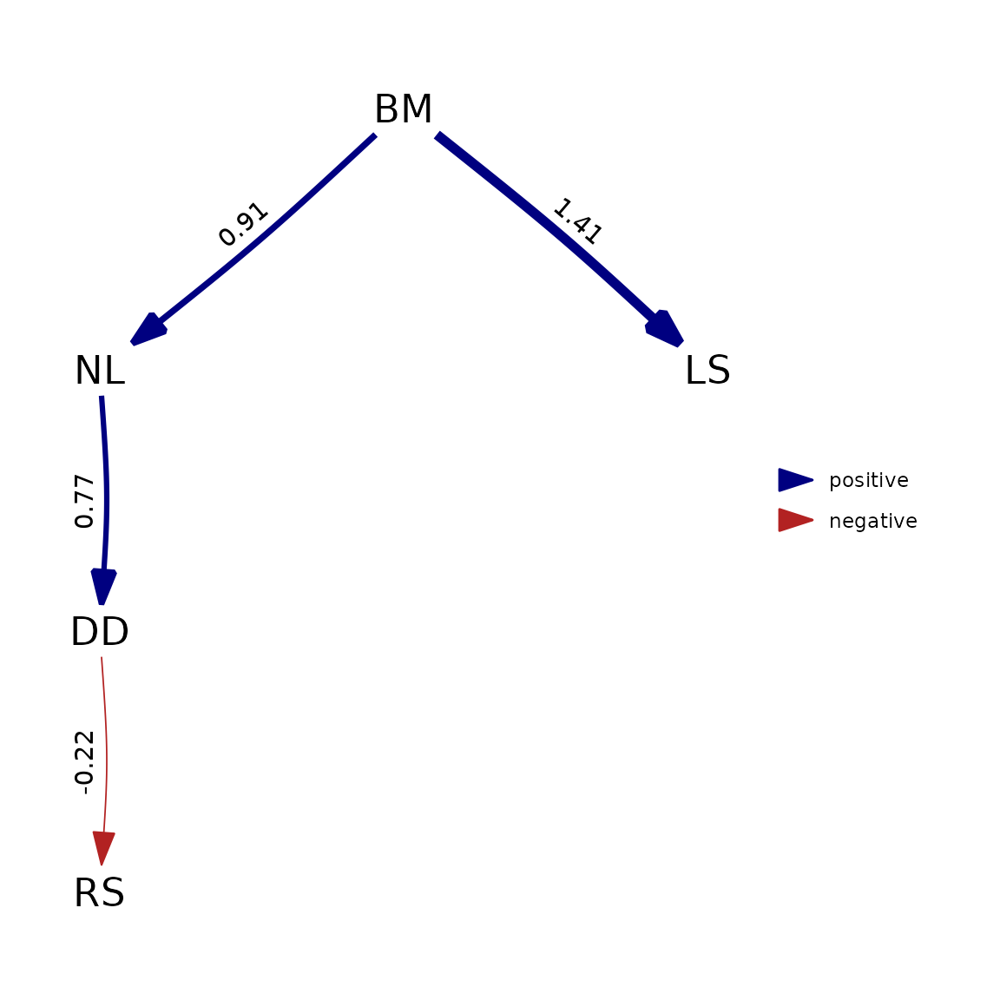

# Comparison with other packages

``` r

library(phylosem)
```

`phylosem` is an R package for fitting phylogenetic structural equation
models (PSEMs). The package generalizes features in existing R packages:

- `sem` for structural equation models (SEMs);
- `phylosem` for comparison among alternative path models;
- `phylolm` for fitting large linear models that arise as when
  specifying a SEM with one endogenous variable and multiple exogenous
  and independent variables;
- `Rphylopars` for interpolating missing values when specifying a SEM
  with an unstructured (full rank) covariance among variables;

In model configurations that can be fitted by both `phylosem` and these
other packages, we have confirmed that results are nearly identical or
otherwise identified reasons that results differ.

`phylosem` involves a simple user-interface that specifies the SEM using
notation from package `sem` and the phylogenetic tree using package
`ape`. It allows uers to specify common models for the covariance
including:

- Brownian motion (BM);
- Ornstein-Uhlenbeck (OU);
- Pagel’s lambda;
- Pagel’s kappa;

Output can be coerced to standard formats so that `phylosem` can use
plotting and summary functions form other packages. Available output
formats include:

- `sem`, for plotting the estimated SEM and summarizing direct and
  indirect effects;
- `phylopath`, for plotting and model comparison;
- `phylo4d` in R-package `phylobase` for plotting estimated traits;

Below, we specifically highlight the syntax, runtime, and output
resulting from `phylosem` and other packages.

## Comparison with phylolm

We first compare syntax and run-times using simulated data against
`phylolm`. This confirms that runtimes from `phylosem` are within an
order of magnitude and that results are nearly identical for BM, OU,
delta, and kappa models.

``` r

# Settings
Ntree = 100
sd_x = 0.3
sd_y = 0.3
b0_x = 1
b0_y = 0
b_xy = 1

# Simulate tree
set.seed(1)
tree = ape::rtree(n=Ntree)

# Simulate data
x = b0_x + sd_x * phylolm::rTrait(n = 1, phy=tree)
ybar = b0_y + b_xy*x
y_normal = ybar + sd_y * phylolm::rTrait(n = 1, phy=tree)

# Construct, re-order, and reduce data
Data = data.frame(x=x,y=y_normal)[]

# Compare using BM model
start_time = Sys.time()
plm_bm = phylolm::phylolm(y ~ 1 + x, data=Data, phy=tree, model="BM" )
Sys.time() - start_time
#> Time difference of 0.005540371 secs
knitr::kable(summary(plm_bm)$coefficients, digits=3)
```

|             | Estimate | StdErr | t.value | p.value |
|:------------|---------:|-------:|--------:|--------:|
| (Intercept) |   -0.371 |  0.214 |  -1.734 |   0.086 |
| x           |    1.117 |  0.101 |  11.053 |   0.000 |

``` r


start_time = Sys.time()
psem_bm = phylosem( sem = "x -> y, p",
          data = Data,
          tree = tree,
          control = phylosem_control(quiet = TRUE) )
Sys.time() - start_time
#> Time difference of 0.1256161 secs
knitr::kable(summary(psem_bm)$coefficients, digits=3)
```

| Path      | VarName     | Estimate | StdErr | t.value | p.value |
|:----------|:------------|---------:|-------:|--------:|--------:|
| NA        | Intercept_x |    1.087 |  0.183 |   5.945 |   0.000 |
| NA        | Intercept_y |   -0.371 |  0.213 |   1.743 |   0.081 |
| x -\> y   | p           |    1.117 |  0.101 |  11.109 |   0.000 |
| x \<-\> x | V\[x\]      |    0.315 |  0.022 |  14.072 |   0.000 |
| y \<-\> y | V\[y\]      |    0.315 |  0.022 |  14.072 |   0.000 |

``` r


# Compare using OU
start_time = Sys.time()
plm_ou = phylolm::phylolm(y ~ 1 + x, data=Data, phy=tree, model="OUrandomRoot" )
Sys.time() - start_time
#> Time difference of 0.01319122 secs

start_time = Sys.time()
psem_ou = phylosem( sem = "x -> y, p",
          data = Data,
          tree = tree,
          estimate_ou = TRUE,
          control = phylosem_control(quiet = TRUE) )
Sys.time() - start_time
#> Time difference of 0.1489389 secs

knitr::kable(summary(psem_ou)$coefficients, digits=3)
```

| Path      | VarName     | Estimate | StdErr | t.value | p.value |
|:----------|:------------|---------:|-------:|--------:|--------:|
| NA        | Intercept_x |    1.028 |  0.208 |   4.946 |   0.000 |
| NA        | Intercept_y |   -0.274 |  0.235 |   1.165 |   0.244 |
| x -\> y   | p           |    1.099 |  0.101 |  10.887 |   0.000 |
| x \<-\> x | V\[x\]      |    0.332 |  0.026 |  12.712 |   0.000 |
| y \<-\> y | V\[y\]      |    0.332 |  0.026 |  12.860 |   0.000 |

``` r

knitr::kable(summary(plm_ou)$coefficients, digits=3)
```

|             | Estimate | StdErr | t.value | p.value |
|:------------|---------:|-------:|--------:|--------:|
| (Intercept) |   -0.781 |  0.389 |  -2.006 |   0.048 |
| x           |    1.095 |  0.101 |  10.850 |   0.000 |

``` r

knitr::kable(c( "phylolm_alpha"=plm_ou$optpar, 
                "phylosem_alpha"=exp(psem_ou$parhat$lnalpha) ), digits=3)
```

|                |     x |
|:---------------|------:|
| phylolm_alpha  | 0.120 |
| phylosem_alpha | 0.105 |

``` r


# Compare using Pagel's lambda
start_time = Sys.time()
plm_lambda = phylolm::phylolm(y ~ 1 + x, data=Data, phy=tree, model="lambda" )
Sys.time() - start_time
#> Time difference of 0.0228827 secs

start_time = Sys.time()
psem_lambda = phylosem( sem = "x -> y, p",
          data = Data,
          tree = tree,
          estimate_lambda = TRUE,
          control = phylosem_control(quiet = TRUE) )
Sys.time() - start_time
#> Time difference of 0.1091344 secs

knitr::kable(summary(psem_lambda)$coefficients, digits=3)
```

| Path      | VarName     | Estimate | StdErr | t.value | p.value |
|:----------|:------------|---------:|-------:|--------:|--------:|
| NA        | Intercept_x |    1.092 |  0.162 |   6.740 |   0.000 |
| NA        | Intercept_y |   -0.346 |  0.200 |   1.726 |   0.084 |
| x -\> y   | p           |    1.092 |  0.103 |  10.559 |   0.000 |
| x \<-\> x | V\[x\]      |    0.284 |  0.025 |  11.367 |   0.000 |
| y \<-\> y | V\[y\]      |    0.290 |  0.024 |  11.897 |   0.000 |

``` r

knitr::kable(summary(plm_lambda)$coefficients, digits=3)
```

|             | Estimate | StdErr | t.value | p.value |
|:------------|---------:|-------:|--------:|--------:|
| (Intercept) |   -0.356 |  0.207 |  -1.718 |   0.089 |
| x           |    1.102 |  0.103 |  10.744 |   0.000 |

``` r

knitr::kable(c( "phylolm_lambda"=plm_lambda$optpar, 
                "phylosem_lambda"=plogis(psem_lambda$parhat$logitlambda) ), digits=3)
```

|                 |     x |
|:----------------|------:|
| phylolm_lambda  | 0.980 |
| phylosem_lambda | 0.957 |

``` r


# Compare using Pagel's kappa
start_time = Sys.time()
plm_kappa = phylolm::phylolm(y ~ 1 + x, data=Data, phy=tree, model="kappa", lower.bound = 0, upper.bound = 3 )
Sys.time() - start_time
#> Time difference of 0.007170677 secs

start_time = Sys.time()
psem_kappa = phylosem( sem = "x -> y, p",
          data = Data,
          tree = tree,
          estimate_kappa = TRUE,
          control = phylosem_control(quiet = TRUE) )
Sys.time() - start_time
#> Time difference of 0.122617 secs

knitr::kable(summary(psem_kappa)$coefficients, digits=3)
```

| Path      | VarName     | Estimate | StdErr | t.value | p.value |
|:----------|:------------|---------:|-------:|--------:|--------:|
| NA        | Intercept_x |    1.078 |  0.186 |   5.783 |   0.000 |
| NA        | Intercept_y |   -0.368 |  0.216 |   1.705 |   0.088 |
| x -\> y   | p           |    1.113 |  0.101 |  11.025 |   0.000 |
| x \<-\> x | V\[x\]      |    0.299 |  0.029 |  10.183 |   0.000 |
| y \<-\> y | V\[y\]      |    0.300 |  0.029 |  10.343 |   0.000 |

``` r

knitr::kable(summary(plm_kappa)$coefficients, digits=3)
```

|             | Estimate | StdErr | t.value | p.value |
|:------------|---------:|-------:|--------:|--------:|
| (Intercept) |   -0.370 |  0.216 |  -1.716 |   0.089 |
| x           |    1.115 |  0.101 |  11.015 |   0.000 |

``` r

knitr::kable(c( "phylolm_kappa"=plm_kappa$optpar, 
                "phylosem_kappa"=exp(psem_kappa$parhat$lnkappa) ), digits=3)
```

|                |     x |
|:---------------|------:|
| phylolm_kappa  | 0.930 |
| phylosem_kappa | 0.857 |

## Generalized linear models

We also compare results among software for fitting phylogenetic
generalized linear models (PGLM).

### Poisson-distributed response

First, we specifically explore a Poisson-distributed PGLM, comparing
`phylosem` against
[`phylolm::phyloglm`](https://rdrr.io/pkg/phylolm/man/phyloglm.html)
(which uses Generalized Estimating Equations) and
[`phyr::pglmm_compare`](https://daijiang.github.io/phyr/reference/pglmm_compare.html)
(which uses maximum likelihood).

``` r

# Settings
Ntree = 100
sd_x = 0.3
sd_y = 0.3
b0_x = 1
b0_y = 0
b_xy = 1

# Simulate tree
set.seed(1)
tree = ape::rtree(n=Ntree)

# Simulate data
x = b0_x + sd_x * phylolm::rTrait(n = 1, phy=tree)
ybar = b0_y + b_xy*x
y_normal = ybar + sd_y * phylolm::rTrait(n = 1, phy=tree)
y_pois = rpois( n=Ntree, lambda=exp(y_normal) )

# Construct, re-order, and reduce data
Data = data.frame(x=x,y=y_pois)

# Compare using phylolm::phyloglm
pglm = phylolm::phyloglm(y ~ 1 + x, data=Data, phy=tree, method="poisson_GEE" )
knitr::kable(summary(pglm)$coefficients, digits=3)
```

|             | Estimate | StdErr | z.value | p.value |
|:------------|---------:|-------:|--------:|--------:|
| (Intercept) |   -1.098 |  0.633 |  -1.736 |   0.083 |
| x           |    1.314 |  0.247 |   5.320 |   0.000 |

``` r


#
pglmm = phyr::pglmm_compare(
  y ~ 1 + x,
  family = "poisson",
  data = Data,
  phy = tree )
#> Warning: the 'nobars' function has moved to the reformulas package. Please
#> update your imports, or ask an upstream package maintainer to do so.
knitr::kable(summary(pglmm), digits=3)
#> Generalized linear mixed model for poisson data fit by restricted maximum likelihood
#> 
#> Call:y ~ 1 + x
#> 
#> logLik    AIC    BIC 
#> -173.4  354.7  360.6 
#> 
#> Phylogenetic random effects variance (s2):
#>    Variance Std.Dev
#> s2  0.06152   0.248
#> 
#> Fixed effects:
#>                Value Std.Error  Zscore    Pvalue    
#> (Intercept) -0.57006   0.30465 -1.8712   0.06132 .  
#> x            1.18134   0.19805  5.9650 2.447e-09 ***
#> ---
#> Signif. codes:  0 '***' 0.001 '**' 0.01 '*' 0.05 '.' 0.1 ' ' 1
```

``` r


#
pgsem = phylosem( sem = "x -> y, p",
          data = Data,
          family = list( x = fixed(), y = poisson() ),
          tree = tree,
          control = phylosem_control(quiet = TRUE) )
knitr::kable(summary(pgsem)$coefficients, digits=3)
```

| Path      | VarName     | Estimate | StdErr | t.value | p.value |
|:----------|:------------|---------:|-------:|--------:|--------:|
| NA        | Intercept_x |    1.087 |  0.183 |   5.945 |   0.000 |
| NA        | Intercept_y |   -0.581 |  0.305 |   1.904 |   0.057 |
| x -\> y   | p           |    1.190 |  0.199 |   5.971 |   0.000 |
| x \<-\> x | V\[x\]      |    0.315 |  0.022 |  14.072 |   0.000 |
| y \<-\> y | V\[y\]      |    0.232 |  0.054 |   4.310 |   0.000 |

We also compare results against `brms` (which fits a Bayesian
hierarchical model), although we load results from compiled run of
`brms` to avoid users having to install STAN to run vignettes for
`phylosem`:

``` r

# Comare using Bayesian implementation in brms
library(brms)
Amat <- ape::vcv.phylo(tree)
Data$tips <- rownames(Data)
mcmc <- brm(
  y ~ 1 + x + (1 | gr(tips, cov = A)),
  data = Data, data2 = list(A = Amat),
  family = 'poisson',
  cores = 4
)
knitr::kable(fixef(mcmc), digits = 3)

# Plot them together
library(ggplot2)
pdat <- rbind.data.frame(
  coef(summary(pglm))[, 1:2],
  data.frame(Estimate = pglmm$B, StdErr = pglmm$B.se),
  setNames(as.data.frame(fixef(mcmc))[1:2], c('Estimate', 'StdErr')),
  setNames(summary(pgsem)$coefficients[2:3, 3:4], c('Estimate', 'StdErr'))
)
pdat$Param <- rep(c('Intercept', 'Slope'), 4)
pdat$Method <- rep( c('phylolm::phyloglm', 'phyr::pglmm_compare',
                     'brms::brm', 'phylosem::phylosem'), each = 2)
figure = ggplot(pdat, aes(
  x = Estimate, xmin = Estimate - StdErr,
  xmax = Estimate + StdErr, y = Param, color = Method
)) +
  geom_pointrange(position = position_dodge(width = 0.6)) +
  theme_classic() +
  theme(panel.grid.major.x = element_line(), panel.grid.minor.x = element_line())
```



In this instance (and in others we have explored), results from
[`phylolm::phyloglm`](https://rdrr.io/pkg/phylolm/man/phyloglm.html) are
generally different while those from `phylosem`,
[`phyr::pglmm_compare`](https://daijiang.github.io/phyr/reference/pglmm_compare.html),
and `brms` are close but not quite identical.

### Binomial regression

We also compare results for a Bernoulli-distributed response using PGLM.
We again compare `phylosem` against
[`phyr::pglmm_compare`](https://daijiang.github.io/phyr/reference/pglmm_compare.html),
and do not explore threshold models which we expect to give different
results due differences in assumptions about how latent variables affect
measurements.

``` r

# Settings
Ntree = 100
sd_x = 0.3
sd_y = 0.3
b0_x = 1
b0_y = 0
b_xy = 1

# Simulate tree
set.seed(1)
tree = ape::rtree(n=Ntree)

# Simulate data
x = b0_x + sd_x * phylolm::rTrait(n = 1, phy=tree)
ybar = b0_y + b_xy*x
y_normal = ybar + sd_y * phylolm::rTrait(n = 1, phy=tree)
y_binom = rbinom( n=Ntree, size=1, prob=plogis(y_normal) )

# Construct, re-order, and reduce data
Data = data.frame(x=x,y=y_binom)

#
pglmm = phyr::pglmm_compare(
  y ~ 1 + x,
  family = "binomial",
  data = Data,
  phy = tree )
knitr::kable(summary(pglmm), digits=3)
#> Generalized linear mixed model for binomial data fit by restricted maximum likelihood
#> 
#> Call:y ~ 1 + x
#> 
#> logLik    AIC    BIC 
#> -63.74 135.47 141.31 
#> 
#> Phylogenetic random effects variance (s2):
#>    Variance Std.Dev
#> s2   0.1217  0.3489
#> 
#> Fixed effects:
#>               Value Std.Error Zscore Pvalue
#> (Intercept) 0.23181   0.60650 0.3822 0.7023
#> x           0.44615   0.45800 0.9741 0.3300
```

``` r


#
pgsem = phylosem( sem = "x -> y, p",
          data = Data,
          family = list( x = fixed(), y = binomial("logit") ),
          tree = tree,
          control = phylosem_control(quiet = TRUE) )
knitr::kable(summary(pgsem)$coefficients, digits=3)
```

| Path      | VarName     | Estimate | StdErr | t.value | p.value |
|:----------|:------------|---------:|-------:|--------:|--------:|
| NA        | Intercept_x |    1.087 |  0.183 |   5.945 |   0.000 |
| NA        | Intercept_y |    0.204 |  0.589 |   0.346 |   0.730 |
| x -\> y   | p           |    0.458 |  0.468 |   0.977 |   0.328 |
| x \<-\> x | V\[x\]      |   -0.315 |  0.022 |  14.072 |   0.000 |
| y \<-\> y | V\[y\]      |    0.290 |  0.284 |   1.020 |   0.308 |

In this instance, `phylosem` and
[`phyr::pglmm_compare`](https://daijiang.github.io/phyr/reference/pglmm_compare.html)
give similar estimates and standard errors for the slope term.

### Summary of PGLM results

Based on these two comparisons, we conclude that phylosem provides an
interface for maximum-likelihood estimate of phylogenetic generalized
linear models (PGLM), and extends this class to include mixed data
(i.e., a combination of different measurement types), missing data, and
non-recursive structural linkages. However, we also encourage further
cross-testing of different software for fitting phylogenetic generalized
linear models.

## Compare with phylopath

We next compare with a single run of `phylopath`. This again confirms
that runtimes are within an order of magnitude and results are identical
for standardized or unstandardized coefficients.

``` r

library(phylopath)
library(phylosem)

# make copy of data that's rescaled
rhino_scaled = rhino
  rhino_scaled[,c("BM","NL","LS","DD","RS")] = scale(rhino_scaled[,c("BM","NL","LS","DD","RS")])

# Fit and plot using phylopath
dag <- DAG(RS ~ DD, LS ~ BM, NL ~ BM, DD ~ NL)
start_time = Sys.time()
result <- est_DAG( DAG = dag,
                    data = rhino,
                    tree = rhino_tree,
                    model = "BM",
                    measurement_error = FALSE )
Sys.time() - start_time
#> Time difference of 0.01095986 secs
plot(result)
```



``` r


# Fit and plot using phylosem
model = "
  DD -> RS, p1
  BM -> LS, p2
  BM -> NL, p3
  NL -> DD, p4
"
start_time = Sys.time()
psem = phylosem( sem = model,
          data = rhino_scaled[,c("BM","NL","DD","RS","LS")],
          tree = rhino_tree,
          control = phylosem_control(quiet = TRUE) )
Sys.time() - start_time
#> Time difference of 0.5689332 secs
plot( as_fitted_DAG(psem) )
#> Warning: Cannot determine which variables of this model are binary, so the scale of its coefficients is unknown.
#>   Paths into a binary variable are log odds ratios, while paths into a continuous variable are standardized regression coefficients.
#> ℹ This model was fitted by a version of phylopath older than 1.4.0, which did not record it. Refit it to label the coefficients, and to stop receiving this warning.
```


## Comparison with sem

We next compare syntax and runtime against R-package `sem`. This
confirms that runtimes are within an order of magnitude when specifying
a star-phylogeny in `phylosem` to match the assumed structure in `sem`

``` r

library(sem)
library(TreeTools)

# Simulation parameters
n_obs = 50
# Intercepts
a1 = 1
a2 = 2
a3 = 3
a4 = 4
# Slopes
b12 = 0.3
b23 = 0
b34 = 0.3
# Standard deviations
s1 = 0.1
s2 = 0.2
s3 = 0.3
s4 = 0.4

# Simulate data
E1 = rnorm(n_obs, sd=s1)
E2 = rnorm(n_obs, sd=s2)
E3 = rnorm(n_obs, sd=s3)
E4 = rnorm(n_obs, sd=s4)
Y1 = a1 + E1
Y2 = a2 + b12*Y1 + E2
Y3 = a3 + b23*Y2 + E3
Y4 = a4 + b34*Y3 + E4
Data = data.frame(Y1=Y1, Y2=Y2, Y3=Y3, Y4=Y4)

# Specify path diagram (in this case, using correct structure)
equations = "
  Y2 = b12 * Y1
  Y4 = b34 * Y3
"
model <- specifyEquations(text=equations, exog.variances=TRUE, endog.variances=TRUE)

# Fit using package:sem
start_time = Sys.time()
Sem <- sem(model, data=Data)
Sys.time() - start_time
#> Time difference of 0.01021361 secs

# Specify star phylogeny
tree_null = TreeTools::StarTree(n_obs)
  tree_null$edge.length = rep(1,nrow(tree_null$edge))
  rownames(Data) = tree_null$tip.label

# Fit using phylosem
start_time = Sys.time()
psem = phylosem( data = Data,
          sem = equations,
          tree = tree_null,
          control = phylosem_control(quiet = TRUE) )
Sys.time() - start_time
#> Time difference of 0.05137658 secs
```

We then compare estimated values for standardized coefficients

|     |     x |
|:----|------:|
| b12 | 0.326 |
| b34 | 0.325 |

| Path      | Parameter | Estimate |
|:----------|:----------|---------:|
| Y1 -\> Y2 | b12       |    0.345 |
| Y3 -\> Y4 | b34       |    0.343 |

and also compare values for unstandardized coefficients:

|         |     x |
|:--------|------:|
| b12     | 0.660 |
| b34     | 0.390 |
| V\[Y1\] | 0.010 |
| V\[Y2\] | 0.038 |
| V\[Y3\] | 0.098 |
| V\[Y4\] | 0.126 |

| Path        | Parameter | Estimate |
|:------------|:----------|---------:|
| Y1 -\> Y2   | b12       |    0.660 |
| Y3 -\> Y4   | b34       |    0.390 |
| Y1 \<-\> Y1 | V\[Y1\]   |    0.010 |
| Y2 \<-\> Y2 | V\[Y2\]   |    0.038 |
| Y3 \<-\> Y3 | V\[Y3\]   |    0.098 |
| Y4 \<-\> Y4 | V\[Y4\]   |    0.126 |

## Comparison with Rphylopars

Finally, we compare syntax and runtime against R-package `Rphylopars`.
This confirms that we can impute identical estimates using both
packages, when specifying a full-rank covariance in `phylosem`

We note that `phylosem` also allows parsimonious representations of the
trait covariance via the inputted SEM structure.

``` r

library(Rphylopars)

# Format data, within no values for species t1
Data = rhino[,c("BM","NL","DD","RS","LS")]
  rownames(Data) = tree$tip.label
Data['t1',] = NA

# fit using phylopars
start_time = Sys.time()
pars <- phylopars( trait_data = cbind(species=rownames(Data),Data),
                  tree = tree,
                  pheno_error = FALSE,
                  phylo_correlated = TRUE,
                  pheno_correlated = FALSE)
Sys.time() - start_time
#> Time difference of 0.1067791 secs

# Display estimates for missing values
knitr::kable(cbind( "Estimate"=pars$anc_recon["t1",], "Var"=pars$anc_var["t1",] ), digits=3)
```

|     | Estimate |   Var |
|:----|---------:|------:|
| BM  |    1.266 | 1.941 |
| NL  |    1.600 | 1.856 |
| DD  |    2.301 | 1.708 |
| RS  |    0.431 | 1.909 |
| LS  |    1.083 | 1.347 |

``` r


# fit using phylosem
start_time = Sys.time()
psem = phylosem( data = Data,
                 tree = tree,
                 sem = "",
                 covs = "BM, NL, DD, RS, LS",
                 control = phylosem_control(quiet = TRUE) )
Sys.time() - start_time
#> Time difference of 0.4972646 secs

# Display estimates for missing values
knitr::kable(cbind(
  "Estimate"=as.list(psem$sdrep,"Estimate")$x_vj[ match("t1",tree$tip.label), ],
  "Var"=as.list(psem$sdrep,"Std. Error")$x_vj[ match("t1",tree$tip.label), ]^2
), digits=3)
```

| Estimate |   Var |
|---------:|------:|
|    1.266 | 1.941 |
|    1.600 | 1.856 |
|    2.301 | 1.708 |
|    0.431 | 1.910 |
|    1.083 | 1.347 |
