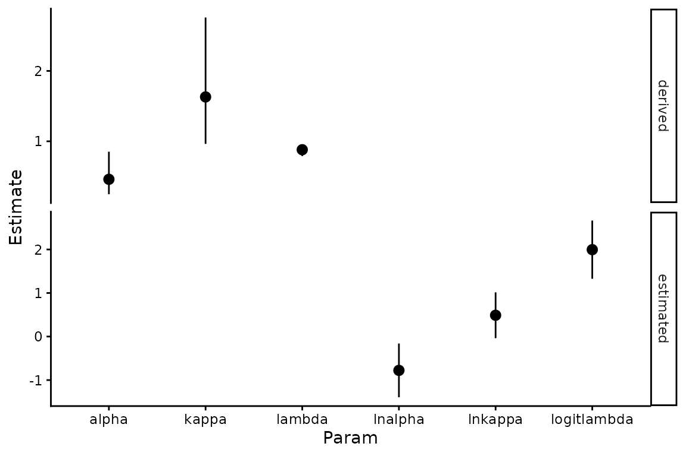
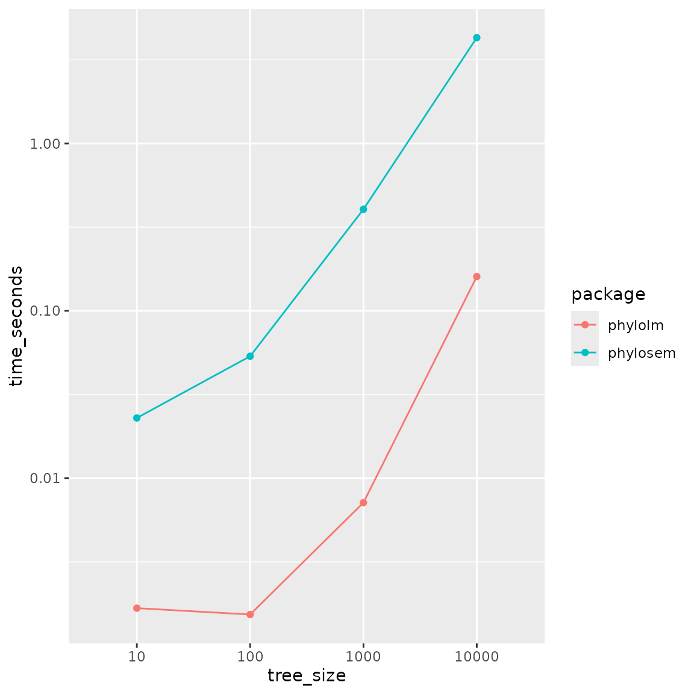

# Demonstration of selected features

``` r

library(phylosem)
```

`phylosem` is an R package for fitting phylogenetic structural equation
models (PSEMs). We here highlight a few features in particular.

## Estimability for multiple covariance transformations

By default, `phylosem` takes as input a phylogenetic tree and constructs
a covariance under a Brownian motion evolutionary model. However, it
also allows any combination of the following transformations:

- Ornstein-Uhlenbeck (OU);
- Pagel’s lambda;
- Pagel’s kappa;

This then results in eight possible covariance models formed from
including or excluding each transformation. We first show that these
transformations are all simultaneously estimable for a reference data
set.

``` r


# Compare using Pagel's kappa
library(phylopath)

# Run phylosem
model = "
  DD -> RS, p1
  BM -> LS, p2
  BM -> NL, p3
  NL -> DD, p4
"
psem = phylosem( sem = model,
          data = rhino[,c("BM","NL","DD","RS","LS")],
          estimate_ou = TRUE,
          estimate_lambda = TRUE,
          estimate_kappa = TRUE,
          tree = rhino_tree,
          control = phylosem_control(
            getJointPrecision = TRUE,
            quiet = TRUE) )

#
V = psem$sdrep$cov.fixed
Rsub = cov2cor(V)[c('lnalpha','logitlambda','lnkappa'),c('lnalpha','logitlambda','lnkappa')]

knitr::kable(c("minimum_eigenvalue"=min(eigen(psem$sdrep$jointPrecision)$values),
             "maximum_eigenvalue"=max(eigen(psem$sdrep$jointPrecision)$values)), digits=3)
```

|                    |         x |
|:-------------------|----------:|
| minimum_eigenvalue |     0.035 |
| maximum_eigenvalue | 43439.097 |

``` r

knitr::kable(Rsub, digits=3)
```

|             | lnalpha | logitlambda | lnkappa |
|:------------|--------:|------------:|--------:|
| lnalpha     |   1.000 |       0.741 |   0.422 |
| logitlambda |   0.741 |       1.000 |   0.183 |
| lnkappa     |   0.422 |       0.183 |   1.000 |

We see that the minimum eigenvalue for the precision matrix (which
corresponds to the maximum eigenvalue of the covariance matrix) is
greater than zero, such that the precision is invertible and the Hessian
matrix is full rank. From this we can see that all parameters are
estimable when applying all three transformations. We also see that
transformation parameters are not perfectly correlated, although the
logit-lambda and ln-alpha parameters have a correlation of approximately
0.75.

We can also extract the standard errors, calculated as the square-root
of the diagonal elements of the covariance matrix. We extract the
estimated values for `lnalpha`, `logitlambda`, and `lnkappa` and plot
plot the 95% confidence interval as their estimates plus or minus 1.96
times their standard errors. These values are all unbounded by
construction. However, we also convert these estimates, lower, and upper
confidence-interval bounds to the conventional parameters `alpha`,
`lambda`, and `kappa`, and plot those as well. These derived quantities
are bounded as expected for Ornstein-Uhlenbeck and Pagel parameters:

``` r

library(ggplot2)
# Compile estimates and SEs
pdat = data.frame( "Estimate" = psem$sdrep$par.fixed[c('lnalpha','logitlambda','lnkappa')],
              "StdErr" = sqrt(diag(V)[c('lnalpha','logitlambda','lnkappa')]) )
pdat = cbind( pdat, "Param" = rownames(pdat))

#
pdat$lower = pdat$Estimate - 1.96*pdat$StdErr
pdat$upper = pdat$Estimate + 1.96*pdat$StdErr
pdat$type = "estimated"

# Transform from log / logit-space to natural space
pdat2 = pdat
pdat2$Param = c("alpha", "lambda", "kappa")
pdat2['lnalpha',c("Estimate","lower","upper")] = exp(pdat2['lnalpha',c("Estimate","lower","upper")])
pdat2['lnkappa',c("Estimate","lower","upper")] = exp(pdat2['lnkappa',c("Estimate","lower","upper")])
pdat2['logitlambda',c("Estimate","lower","upper")] = plogis(as.numeric(pdat2['logitlambda',c("Estimate","lower","upper")]))
pdat2$type = "derived"

# Plot
ggplot( rbind(pdat,pdat2), aes( x=Param, y = Estimate, ymin = lower, ymax = upper)) +
  geom_pointrange(position = position_dodge(width = 0.6)) +
  theme_classic() +
  facet_grid( rows=vars(type), scales="free" )
```



These confidence intervals suggest that parameter lnkappa overlaps with
0.0, suggesting that Pagel’s kappa overlaps with 1.0 and could be
instead turned off and thereby fixed at that default value.

We note in passing that we could instead estimate Bayesian credible
intervals, using improper (flat) priors on all input parameters and
using `tmbstan` to automate MCMC sampling. To speed up the
demonstration, we eliminate the tree transformations and only sample
path coefficients:

``` r

library(tmbstan)

psem0 = phylosem( sem = model,
          data = rhino[,c("BM","NL","DD","RS","LS")],
          tree = rhino_tree,
          control = phylosem_control(
            run_model = TRUE,
            quiet = TRUE) )
MCMC = tmbstan( psem0$obj, init = "last.par.best" )
#> Warning in tmbstan(psem0$obj, init = "last.par.best"): Re-cycling inits to
#> match number of chains
#> 
#> SAMPLING FOR MODEL 'tmb_generic' NOW (CHAIN 1).
#> Chain 1: 
#> Chain 1: Gradient evaluation took 0.000294 seconds
#> Chain 1: 1000 transitions using 10 leapfrog steps per transition would take 2.94 seconds.
#> Chain 1: Adjust your expectations accordingly!
#> Chain 1: 
#> Chain 1: 
#> Chain 1: Iteration:    1 / 2000 [  0%]  (Warmup)
#> Chain 1: Iteration:  200 / 2000 [ 10%]  (Warmup)
#> Chain 1: Iteration:  400 / 2000 [ 20%]  (Warmup)
#> Chain 1: Iteration:  600 / 2000 [ 30%]  (Warmup)
#> Chain 1: Iteration:  800 / 2000 [ 40%]  (Warmup)
#> Chain 1: Iteration: 1000 / 2000 [ 50%]  (Warmup)
#> Chain 1: Iteration: 1001 / 2000 [ 50%]  (Sampling)
#> Chain 1: Iteration: 1200 / 2000 [ 60%]  (Sampling)
#> Chain 1: Iteration: 1400 / 2000 [ 70%]  (Sampling)
#> Chain 1: Iteration: 1600 / 2000 [ 80%]  (Sampling)
#> Chain 1: Iteration: 1800 / 2000 [ 90%]  (Sampling)
#> Chain 1: Iteration: 2000 / 2000 [100%]  (Sampling)
#> Chain 1: 
#> Chain 1:  Elapsed Time: 67.251 seconds (Warm-up)
#> Chain 1:                69.353 seconds (Sampling)
#> Chain 1:                136.604 seconds (Total)
#> Chain 1: 
#> 
#> SAMPLING FOR MODEL 'tmb_generic' NOW (CHAIN 2).
#> Chain 2: 
#> Chain 2: Gradient evaluation took 0.000256 seconds
#> Chain 2: 1000 transitions using 10 leapfrog steps per transition would take 2.56 seconds.
#> Chain 2: Adjust your expectations accordingly!
#> Chain 2: 
#> Chain 2: 
#> Chain 2: Iteration:    1 / 2000 [  0%]  (Warmup)
#> Chain 2: Iteration:  200 / 2000 [ 10%]  (Warmup)
#> Chain 2: Iteration:  400 / 2000 [ 20%]  (Warmup)
#> Chain 2: Iteration:  600 / 2000 [ 30%]  (Warmup)
#> Chain 2: Iteration:  800 / 2000 [ 40%]  (Warmup)
#> Chain 2: Iteration: 1000 / 2000 [ 50%]  (Warmup)
#> Chain 2: Iteration: 1001 / 2000 [ 50%]  (Sampling)
#> Chain 2: Iteration: 1200 / 2000 [ 60%]  (Sampling)
#> Chain 2: Iteration: 1400 / 2000 [ 70%]  (Sampling)
#> Chain 2: Iteration: 1600 / 2000 [ 80%]  (Sampling)
#> Chain 2: Iteration: 1800 / 2000 [ 90%]  (Sampling)
#> Chain 2: Iteration: 2000 / 2000 [100%]  (Sampling)
#> Chain 2: 
#> Chain 2:  Elapsed Time: 66.542 seconds (Warm-up)
#> Chain 2:                72.075 seconds (Sampling)
#> Chain 2:                138.617 seconds (Total)
#> Chain 2: 
#> 
#> SAMPLING FOR MODEL 'tmb_generic' NOW (CHAIN 3).
#> Chain 3: 
#> Chain 3: Gradient evaluation took 0.000273 seconds
#> Chain 3: 1000 transitions using 10 leapfrog steps per transition would take 2.73 seconds.
#> Chain 3: Adjust your expectations accordingly!
#> Chain 3: 
#> Chain 3: 
#> Chain 3: Iteration:    1 / 2000 [  0%]  (Warmup)
#> Chain 3: Iteration:  200 / 2000 [ 10%]  (Warmup)
#> Chain 3: Iteration:  400 / 2000 [ 20%]  (Warmup)
#> Chain 3: Iteration:  600 / 2000 [ 30%]  (Warmup)
#> Chain 3: Iteration:  800 / 2000 [ 40%]  (Warmup)
#> Chain 3: Iteration: 1000 / 2000 [ 50%]  (Warmup)
#> Chain 3: Iteration: 1001 / 2000 [ 50%]  (Sampling)
#> Chain 3: Iteration: 1200 / 2000 [ 60%]  (Sampling)
#> Chain 3: Iteration: 1400 / 2000 [ 70%]  (Sampling)
#> Chain 3: Iteration: 1600 / 2000 [ 80%]  (Sampling)
#> Chain 3: Iteration: 1800 / 2000 [ 90%]  (Sampling)
#> Chain 3: Iteration: 2000 / 2000 [100%]  (Sampling)
#> Chain 3: 
#> Chain 3:  Elapsed Time: 67.903 seconds (Warm-up)
#> Chain 3:                67.919 seconds (Sampling)
#> Chain 3:                135.822 seconds (Total)
#> Chain 3: 
#> 
#> SAMPLING FOR MODEL 'tmb_generic' NOW (CHAIN 4).
#> Chain 4: 
#> Chain 4: Gradient evaluation took 0.000258 seconds
#> Chain 4: 1000 transitions using 10 leapfrog steps per transition would take 2.58 seconds.
#> Chain 4: Adjust your expectations accordingly!
#> Chain 4: 
#> Chain 4: 
#> Chain 4: Iteration:    1 / 2000 [  0%]  (Warmup)
#> Chain 4: Iteration:  200 / 2000 [ 10%]  (Warmup)
#> Chain 4: Iteration:  400 / 2000 [ 20%]  (Warmup)
#> Chain 4: Iteration:  600 / 2000 [ 30%]  (Warmup)
#> Chain 4: Iteration:  800 / 2000 [ 40%]  (Warmup)
#> Chain 4: Iteration: 1000 / 2000 [ 50%]  (Warmup)
#> Chain 4: Iteration: 1001 / 2000 [ 50%]  (Sampling)
#> Chain 4: Iteration: 1200 / 2000 [ 60%]  (Sampling)
#> Chain 4: Iteration: 1400 / 2000 [ 70%]  (Sampling)
#> Chain 4: Iteration: 1600 / 2000 [ 80%]  (Sampling)
#> Chain 4: Iteration: 1800 / 2000 [ 90%]  (Sampling)
#> Chain 4: Iteration: 2000 / 2000 [100%]  (Sampling)
#> Chain 4: 
#> Chain 4:  Elapsed Time: 63.736 seconds (Warm-up)
#> Chain 4:                66.902 seconds (Sampling)
#> Chain 4:                130.638 seconds (Total)
#> Chain 4:
```

## Scaling of runtime with increased tree size

The package `phylolm` is expected to have a “linear runtime”, i.e., a
proportional increase in runtime with increasing tree size. We therefore
compare runtime for `phylosem` and `phylolm` using a simulated tree
across three orders of magnitude (10, 100, 1000, or 10000 tips).

``` r

# Settings
Ntree_config = c( 1e1, 1e2, 1e3, 1e4 )
Nreplicates = 5
sd_x = 0.3
sd_y = 0.3
b0_x = 1
b0_y = 0
b_xy = 1

# Simulate tree
set.seed(1)
Time_rcz = array(NA, dim=c(Nreplicates,length(Ntree_config),2), dimnames=list(NULL,"tree_size"=Ntree_config,"package"=c("phylolm","phylosem")) )

for( rI in seq_len(Nreplicates) ){
for( cI in seq_along(Ntree_config) ){

  # Simulate data
  tree = ape::rtree(n=Ntree_config[cI])
  x = b0_x + sd_x * phylolm::rTrait(n = 1, phy=tree)
  ybar = b0_y + b_xy*x
  y_normal = ybar + sd_y * phylolm::rTrait(n = 1, phy=tree)
  Data = data.frame(x=x, y=y_normal)[]

  # Run phylolm
  start_time = Sys.time()
  plm_bm = phylolm::phylolm(y ~ 1 + x, data=Data, phy=tree, model="BM" )
  Time_rcz[rI,cI,"phylolm"] = Sys.time() - start_time

  # Run phylosem
  start_time = Sys.time()
  psem_bm = phylosem( sem = "x -> y, p",
            data = Data,
            tree = tree,
            control = phylosem_control(
              quiet = TRUE,
              newton_loops = 0,
              getsd = FALSE) )
  Time_rcz[rI,cI,"phylosem"] = Sys.time() - start_time
}}

# Format
df = apply( Time_rcz, MARGIN=2:3, FUN=mean )
df = cbind( expand.grid(dimnames(df)), "time_seconds"=as.vector(df) )

# Plot
library(ggplot2)
ggplot(data=df, aes(x=tree_size, y=time_seconds, group=package, color=package)) +
  geom_line() +
  geom_point() + scale_y_log10()
```



Results show that both packages have approximately linear runtime, but
that `phylolm` is approximately 10-100 times faster for any given tree
size.
